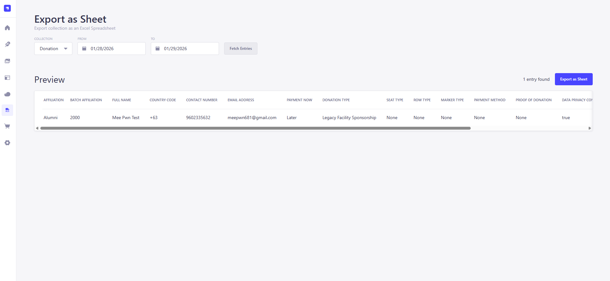
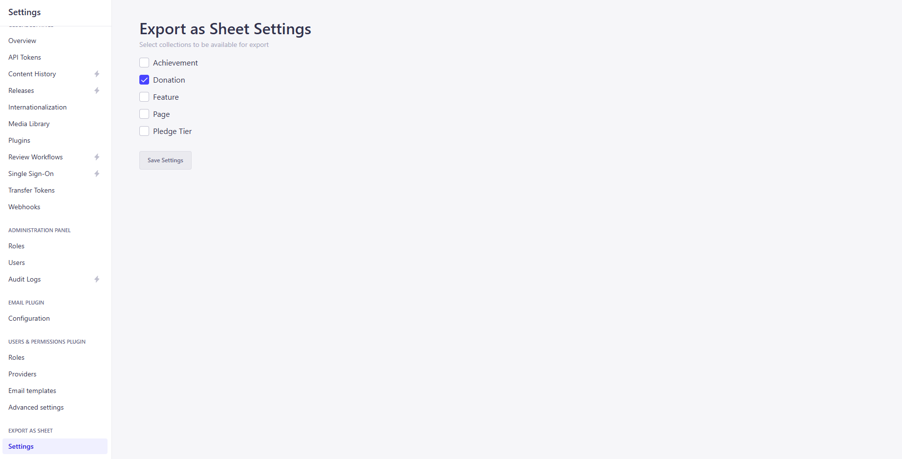
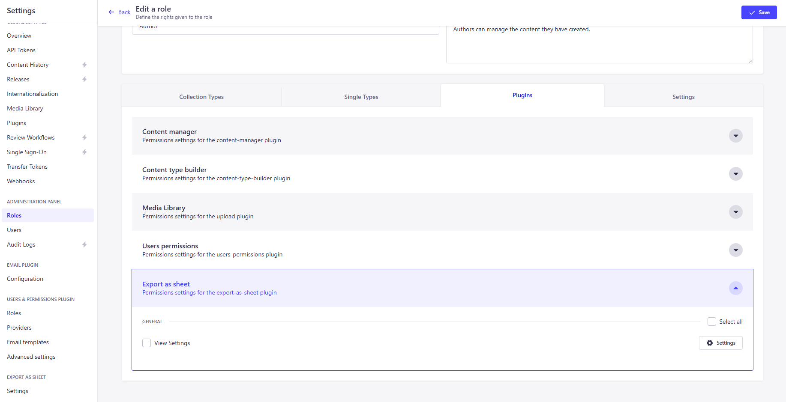

# strapi-plugin-export-as-sheet

A plugin for Strapi to export a collection as an Excel Spreadsheet.



## Requirements
- Strapi v5.33.3 or higher

## Installation
```
npm i strapi-plugin-export-as-sheet
```

## Settings
This plugin has its own Settings section where user can select which collections can be exportable. 
In the Admin Panel side bar, go to `Settings` then scroll down until you see the `Export as Sheet` section and the `Settings` page.



You can also set privilege on which user role can access the Settings Page.



## Supported Fields
As of v1.0.3, currently supported field types are `string`, `datetime`, `Single Media`, `boolean`, and `number`. Upcoming upgrades will include support for `Mutiple Media`, and `Components`.

For those attributes that has prop visible of `false` and `publishedAt`, they are not currently included with the fetched data.

## Changelog

### 1.0.1
- Added validation for column of type 'datetime' before parsing to ISO format

### 1.0.2
- Added dialog pop-up if error occurs during API call

### 1.0.3
- Adjusted button heights
